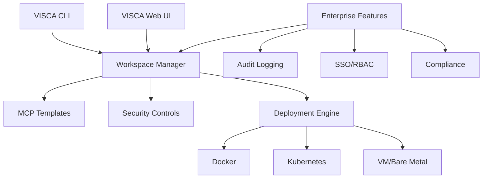

# VISCA - Enterprise Fleet Management For Open Source AI

<p align="center">
  
  <br>
  <em>Deploy and manage open-source AI tools as secure workspaces</em>
</p>

VISCA (Verifiable, Interoperable, Secure, Compliant AI) transforms unmanageable open-source AI tools into secure, compliant, enterprise-ready workspaces - it's like the Red Hat OpenShift for AI tools that brings enterprise security and governance to the open-source AI ecosystem.

We're making software that lets enterprises deploy open-source AI tooling safely in minutes instead of waiting 6+ months for security approval. Think of it as "run your own AI tool fleet" that companies install on their own servers.

VISCA packages open-source AI tooling like GitHub Copilot MCP servers, document processors, and code assistants into secure workspaces with built-in compliance controls, audit logging, and enterprise security features. Over 15,000 regulated enterprises need this - banks, hospitals, and government agencies that want AI tooling but can't use public APIs.

[](https://opensource.org/licenses/MIT)

## The Problem

**AI adoption in enterprises is stuck:**

> "We built an amazing AI proof-of-concept in 2 weeks, then waited 6 months for security approval. By then, the team had moved on." — Fortune 500 AI Product Manager

Enterprises face critical barriers to adopting open-source AI tools:

- **6+ month security reviews** per individual AI tool
- **Custom infrastructure work** required for each deployment
- **Compliance gaps** between open-source tools and enterprise requirements
- **Scaling challenges** across distributed teams and environments
- **Risk of shadow AI** when teams bypass security to use unapproved tools

Without a standardized approach, enterprises either block innovation or accept dangerous security risks.

## The Solution

VISCA is a fleet manager for deploying open-source AI tools as secure, managed workspaces:

- **Open-source CLI:** Deploy and collaborate on AI tool workspaces in minutes
- **Workspace-based deployment:** Run any open-source AI tool in isolated, secure environments
- **Team collaboration:** Built into both CLI and web interface
- **Enterprise controls:** Audit logging, SSO, compliance monitoring
- **Deployment flexibility:** Cloud, self-hosted, or air-gapped environments
- **Standard interfaces:** Consistent management across your AI tool fleet

## How It Works

```bash
# Create a secure GitHub Copilot MCP workspace with governance controls
visca create secure-copilot --template github-copilot-mcp \
  --parameter "security_pii_detection=enabled" \
  --parameter "security_code_scanning=enabled" \
  --parameter "compliance_audit_logging=verbose"

# Deploy with team access and consistent security policies
visca create shared-copilot-mcp --template github-copilot-mcp \
  --org engineering-team \
  --parameter "allowed_repositories=github.com/your-org/*" \
  --parameter "network_policy=restricted" 

# Monitor usage, performance and compliance across your AI tool fleet
visca list
visca schedule status secure-copilot
visca show secure-copilot --output json > workspace-details.json

# Scale and manage your AI tool fleet with automatic updates and schedules
visca create batch-processor --template mcp-llama-70b \
  --start-at "0 9 * * 1-5" \
  --stop-after 8h \
  --automatic-updates always
```

## Deployment Options

| Feature | Open-Source CLI | Team SaaS | Enterprise |
|---------|----------------|-----------|------------|
| MCP Workspace Templates | ✅ | ✅ | ✅ |
| Secure Deployments | ✅ | ✅ | ✅ |
| Web Management UI | ❌ | ✅ | ✅ |
| Team Collaboration | ✅ | ✅ | ✅ |
| SSO & RBAC | ❌ | ❌ | ✅ |
| Compliance Reporting | ❌ | ❌ | ✅ |
| Air-gapped Support | ✅ | ✅ | ✅ |

## Why VISCA?

- **For Developers:** Deploy AI tools without fighting security teams
- **For Security Teams:** Enforce standards without blocking innovation
- **For Enterprises:** Adopt AI safely in regulated environments

## Architecture



## Getting Started

```bash
# Install the VISCA CLI
curl -sSL https://get.visca.ai | sh

# Login and create your first workspace
visca login
visca create my-first-workspace --template mcp-llama-70b --yes
```

## MCP Workspace Templates (Coming Soon)

VISCA will provide enterprise-ready templates for popular Model Context Protocol servers using Terraform for infrastructure as code:

| Template | Description | Use Case |
|----------|-------------|----------|
| `github-copilot-mcp` | GitHub Copilot's MCP server with enterprise security controls | Code generation, PR reviews |
| `mcp-custom` | Build your own MCP server with security defaults | Custom AI applications |

Templates will be defined as `.tf` files, enabling version-controlled infrastructure as code with enterprise-grade security and compliance features built in.

## Project Structure (In Development)

```
├── cmd/                # Command-line applications
│   └── visca/          # Main CLI application
├── pkg/                # Core packages
│   ├── workspace/      # Workspace management
│   ├── templates/      # MCP and other tool templates
│   ├── security/       # Security controls and scanning
│   ├── deploy/         # Deployment engines
│   └── api/            # API for Web UI integration
├── web/                # Web UI (Team and Enterprise)
└── enterprise/         # Enterprise features
```

## Infrastructure Support (Coming Soon)

VISCA will support multiple infrastructure options including Docker, Kubernetes, and VM/bare metal environments, with consistent security and management interfaces across all deployment targets.

## Roadmap & Features

VISCA is currently in early development. We're building features gradually, starting with MCP workspace management. Below is our feature roadmap:

### Core Functionality (In Progress)
- **MCP Workspace Templates** - Secure deployment patterns for Model Context Protocol servers
- **CLI Core Functionality** - Basic workspace management capabilities
- **Deployment Targets** - Support for Docker, Kubernetes, and VM deployments

### Future Development Roadmap

| Feature Category | Community Edition | Enterprise Edition |
|-----------------|-------------------|-------------------|
| **AI Agents & Integration** |
| MCP Server Templates | ✅ | ✅ |
| AI Agent Management | ✅ | ✅ |
| Task Management | ✅ | ✅ |
| Boundary Controls | ❌ | ✅ |
| **Developer Experience** |
| Unlimited Workspaces | ✅ | ✅ |
| Cross-platform (Linux, macOS, Windows) | ✅ | ✅ |
| Web IDE Support | ✅ | ✅ |
| Desktop IDE Support | ✅ | ✅ |
| IDE Plugins (VS Code, JetBrains) | ✅ | ✅ |
| VISCA Desktop | ✅ | ✅ |
| Dynamic Parameters | ✅ | ✅ |
| OSS Integrations (Backstage) | ✅ | ✅ |
| Notifications | ✅ | ✅ |
| Workspace Autostart/Autostop | ✅ | ✅ |
| External Authentication Integrations | Limited (1) | Unlimited |
| **Platform Experience** |
| Unlimited Templates | ✅ | ✅ |
| Web UI, CLI, REST API | ✅ | ✅ |
| Prometheus Metrics | ✅ | ✅ |
| Template Usage Insights | ❌ | ✅ |
| Prebuilt Workspaces | ❌ | ✅ |
| Workspace Proxies | ❌ | ✅ |
| External Provisioners | ❌ | ✅ |
| High Availability | ❌ | ✅ |
| Web UI Notifications | ❌ | ✅ |
| Quiet Hours | ❌ | ✅ |
| Customizable Branding | ❌ | ✅ |
| **User Management** |
| SSO (OpenID Connect) | ❌ | ✅ |
| Roles | ❌ | ✅ |
| Groups | ❌ | ✅ |
| OIDC Group & Role Sync | ❌ | ✅ |
| SCIM Provisioning & Deprovisioning | ❌ | ✅ |
| Multi-organization Access Control | ❌ | ✅ |
| Custom Roles | ❌ | ✅ |
| **Cloud Cost Control** |
| Enforce Workspace Scheduling | ❌ | ✅ |
| Autostop Requirement | ❌ | ✅ |
| Resource Quotas per User | ❌ | ✅ |
| Resource Quotas per Organization | ❌ | ✅ |
| Clean Up Unused Workspaces | ❌ | ✅ |
| **Governance** |
| Audit Logging | ❌ | ✅ |
| Template Permissions | ❌ | ✅ |
| Enforce Workspace Updates | ❌ | ✅ |
| Disable SSH | ❌ | ✅ |
| Workspace Command Logging | ❌ | ✅ |
| **Support** |
| Community Support (GitHub, Discord) | ✅ | ✅ |
| Ticket-based Global Support | ❌ | ✅ |
| SLA | ❌ | ✅ |

We're prioritizing development based on customer feedback and market demand. Join our beta program to influence our roadmap!

## Community & Support

- [Documentation](https://docs.visca.ai)
- [GitHub Issues](https://github.com/visca-ai/core/issues)

## Enterprise Features

For enterprise deployments including SSO, compliance features, audit logging, and air-gapped deployments, contact [enterprise@visca.ai](mailto:enterprise@visca.ai).

## Quick Demo

<p align="center">
  <a href="https://www.youtube.com/watch?v=dQw4w9WgXcQ">
    
  </a>
  <br>
  <em>Click to watch the demo video</em>
</p>

## Security & Compliance

VISCA provides enterprise-grade security for open-source AI tools:

- **Isolated Workspaces**: Containerized environments with network policies
- **Vulnerability Scanning**: Continuous scanning of dependencies
- **Secrets Management**: Secure handling of API keys and credentials
- **Access Controls**: Fine-grained RBAC for workspace access
- **Audit Logging**: Comprehensive logs for compliance reporting
- **Data Lineage**: Track data flow through AI systems

## FAQ

<details>
<summary><b>How is VISCA different from just using Docker/Kubernetes?</b></summary>
<p>
VISCA adds AI-specific security controls, compliance features, and standardized templates on top of container orchestration. While you could build these yourself, VISCA saves months of custom development and security review cycles.
</p>
</details>

<details>
<summary><b>Does VISCA work in air-gapped environments?</b></summary>
<p>
Yes! VISCA Enterprise supports fully air-gapped deployments with offline model delivery, updates, and compliance reporting.
</p>
</details>

<details>
<summary><b>How do you handle model weights and large files?</b></summary>
<p>
VISCA includes efficient model storage, versioning, and delivery mechanisms optimized for large AI assets, with optional compression and chunking for improved deployment speed.
</p>
</details>

<details>
<summary><b>What's your pricing model?</b></summary>
<p>
VISCA follows a tiered approach: free open-source CLI, team SaaS ($50/user/month), and enterprise deployments (starting at $50K annually). Contact us for custom pricing.
</p>
</details>

## Contributing

We welcome contributions to VISCA! To get started:

1. Fork the repository
2. Create your feature branch (`git checkout -b feature/amazing-feature`)
3. Commit your changes (`git commit -m 'Add some amazing feature'`)
4. Push to the branch (`git push origin feature/amazing-feature`)
5. Open a Pull Request

For major changes, please open an issue first to discuss what you'd like to change.

## Our Story

VISCA was born from firsthand experience with enterprise AI adoption barriers. Our team witnessed how AI proof-of-concepts would take 6+ months to pass security reviews in regulated environments. This friction meant promising AI tools were abandoned despite clear business value.

We're building VISCA to solve this problem - making enterprise AI adoption safe, compliant, and fast.

## Get Involved

- **Developers**: [Star our GitHub repo](https://github.com/visca-ai/core)
- **Early Adopters**: [Join our beta program](https://visca.ai/beta)
- **Enterprises**: [Schedule a demo](https://visca.ai/demo)

## License

VISCA Core is MIT licensed. Enterprise features are available under a commercial license.
